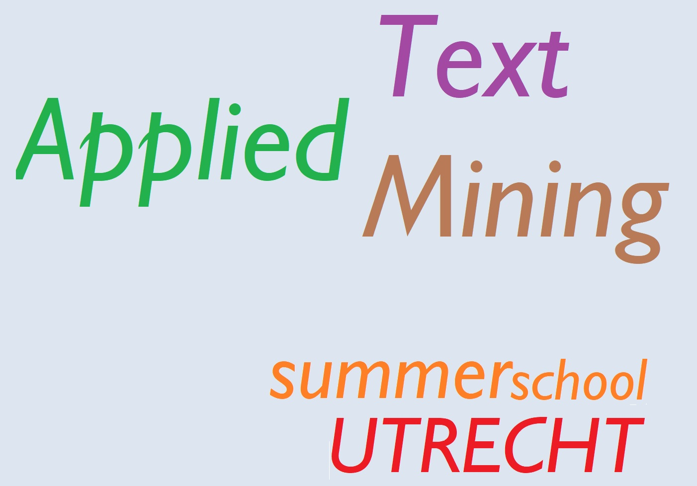

# Intro {.sidebar}

This dashboard covers the materials for the workshop on Transformers.

------------------------------------------------------------------------

<!-- 
 -->

<!-- {width=100%} -->

<!-- 
 -->

\
Speakers:

* [Ayoub Bagheri](https://www.uu.nl/staff/ABagheri)

* [Albert Gatt](https://www.uu.nl/staff/AGatt)

* [Hadi Mohammadi](https://www.uu.nl/staff/HMohammadi)

\
Location: [Hijmans van den Berghgebouw 3.63](https://www.uu.nl/hijmans-van-den-berghgebouw)

------------------------------------------------------------------------

# Home

## Column 1

### Outline

In this workshop, participants will delve into the world of text mining, leveraging the power of transformer models to analyze, classify, and interpret (large-scale) text data. The workshop emphasizes a practical, hands-on approach, allowing attendees to work with real-world data sets.

The workshop deals with the following topics:

* Understand the architecture and functioning of LSTM networks.
* Explore the fundamental principles of encoder-decoder architectures in natural language processing.
* Investigate the role of attention mechanisms in improving the performance of neural network models.
* Delve into the transformer architecture, a cornerstone in modern NLP.
* Implement encoder-decoder models, LSTMs, and transformers in Python.
* Investigate how transformers can be fine-tuned for specific tasks.

### Practicalities

Participants should have a basic knowledge of NLP/ML/data science and know programming and scripting in Python.

Participants are requested to bring their own laptop for the lab meetings.

### Additional reference
Chapter 10 of Jurafsky, D., Martin, J.H. (2023). Speech and language processing, third edition. Find [here](https://web.stanford.edu/~jurafsky/slp3/) online.

## Column 2

### Daily schedule

| Start time | End time | Type      |
|:-----------|:---------|:----------|
|  09:00     | 10:15    | Lecture   |
|            |**Break** |           |
|  10:30     | 11:30    | Practical |
|  11:30     | 12:00    | Discussion|

# How to prepare

## Column 1

### Preparing your machine for the workshop

Bring a laptop computer to the workshop and make sure that you have an Internet connection to be able to use Python in Google Colab. If you are using PyCharm or Jupyte Notebook, also check that you have full write access and administrator rights to the machine. We will explore programming and compiling in this workshop. Some corporate laptops come with limited access for their users, we therefore advise you to bring a personal laptop computer, if you have one.

### Python in Google Colab
Python is a general-purpose interpreted, interactive, object-oriented, and high-level programming language. It is a powerful environment for scientific computing.

We expect that many of you will have some experience with Python; for the rest of you, this section will serve as a quick crash course both on the Python programming language and on the use of Python in Google Colab:

Follow the [tutorial on Python in Google Colab for the Applied Text Mining course from here.](Python_in_Google_Colab_Applied_Text_Mining.html)

This tutorial is mainly from the [CS231n Python Tutorial With Google Colab](https://colab.research.google.com/github/cs231n/cs231n.github.io/blob/master/python-colab.ipynb#scrollTo=dzNng6vCL9eP).

# Day 1

## Column 1

#### Lecture

-   [Sequence modeling](lectures/lecture_01.pdf)

#### Lab
-   [Recurrent neural networks versus CNNs](practicals/practical_01_answers.html)

# Day 2

## Column 1

#### Lecture

-   [Transformers](lectures/lecture_02.pdf)

#### Lab

-   [Classification with transformers](practicals/practical_02_answers.html)